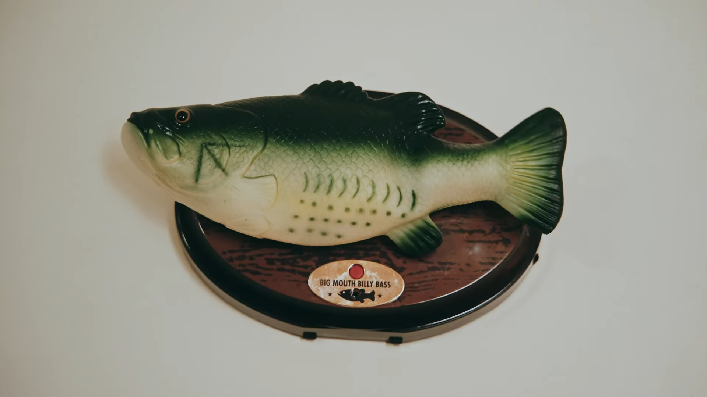

# Software & electronics

## Racine

<a href="https://hgrf.github.io/racine">Racine</a> is a tool that enables researchers to keep track of their samples. It runs on a central server in the local network of your research institute and can be accessed using a web browser. Features include file import from Samba servers, sharing samples while protecting individual users' notes, LaTeX typesetting and many more. I started working on Racine during my research work in the Physics Laboratory at Ecole Normale Supérieure. Today, it is used in laboratories in Germany, France and Switzerland.

## El Poisson

<a href="https://github.com/hgrf/el-poisson-billy">El Poisson</a> is yet another hacked Big Mouth Billy Bass. It was a little contribution to <a href="https://linktr.ee/mooreamusic">Moorea</a>'s 2023 music video <a href="https://www.youtube.com/watch?v=xZalNH8_v24">"Un effort"</a>. This particular hack features a Bluetooth audio sink and motor control via bluetooth. The python GUI is easy to use and can even connect to Ableton via a virtual MIDI interface, so that the fish's movements can be programmed as a MIDI track.

# Physics

During my [PhD](https://www.theses.fr/2019SORUS624/document) in semiconductor physics under the supervision of Dr. Bernard Plaçais and Prof. Edwin Hang Tong Teo,
I have participated in the following publications:

* [A corner reflector of graphene Dirac fermions as a phonon-
scattering sensor. Nature Communications 10, 2428 (2019)](https://www.nature.com/articles/s41467-019-10326-6.pdf)
* [Ultra-long wavelength Dirac plasmons in graphene capacitors. Journal of Physics Materials 1, 01LT02 (2018)](https://iopscience.iop.org/article/10.1088/2515-7639/aadd8c/pdf)
* [Landau velocity for collective quantum Hall
breakdown in bilayer graphene. Physical Review Letters 121, 136804 (2018)](https://journals.aps.org/prl/abstract/10.1103/PhysRevLett.121.136804)

# Find me on

* [github](http://www.github.com/hgrf)
* [Google Scholar](https://scholar.google.fr/citations?user=eTakjF4AAAAJ&hl=en)
* [ORCiD](https://orcid.org/0000-0002-2531-1775)
